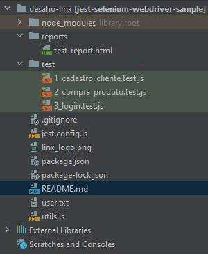

#Desafio Linx

Neste projeto foi desenvolvido o desafio proposto de criar uma framework de automação a partir de qualquer linguagem de minha escolha e então realizar os testes solicitados no documento do desafio.

###  Tecnologias Utilizadas

Para o desenvolvimento desta framework foi utilizado Javascript como linguagem base e também a framework de testes open Source desenvolvida pelo Facebook chamada Jest.

O principal motivador pela escolha da framework e linguagem foi o uso da mesma no meu ambiente de trabalho e tendo em vista a satisfação na velocidade de entrega e desenvolvimento de novos testes, sem contar seu crescimento como framework nos últimos anos:

Em conjunto com o selenium Webdriver (driver que utilizo neste projeto), é possível construir uma arquitetura de automação de testes robusta em pouco tempo.
Também utilizei algumas npm's para geração de relatório mais detalhado e integração com o LambdaTest, a maior plataforma de testes em nuvem para automação.

###  Estrutura do projeto

Na imagem abaixo vemos a estrutura base do projeto, onde **jest.config.js** ficam as configurações do Jest como execução sequencial e caminho dos reports a serem salvos.
Também temos a utils.js, onde encontra-se as funções base utilizadas em todo o projeto por  cada execução de um novo teste.

### Instalação

#### Nodejs

Para realizar a instalação é bem simples. Primeiro precisa ter certeza de que você tenha instalado em sua maquina o nodeJs, para a instalação e uso das npm's presentes no projeto. Para instalar basta fazer o download do instalador no link https://nodejs.org/en/.

#### ChromeDriver

1. Essa configuração do chromeDriver é importante para a execução dos testes antes de mais nada, tendo em vista que a versão que se encontra na sua máquina precisa ser a mesma do npm instalado no projeto, que no caso é a versão do link https://chromedriver.storage.googleapis.com/index.html?path=87.0.4280.88/.

2. Basta baixá-la e configurar como variável de ambiente para que seu prompt de comando reconheça o comando "chromedriver" como no link a seguir: https://zwbetz.com/download-chromedriver-binary-and-add-to-your-path-for-automated-functional-testing/

#### Instalar as NPMs
Após realizar os passos anteriores basta abrir o projeto e executar o comando no terminal na pasta do mesmo **NPM INSTALL** e aguarde o término da instalação.

#### Divirta-se
Por fim, basta executar o comando **NPM RUN TEST** e ver a magia acontecer.

###### OBS: Os reports se encontram dentro da pasta "reports", ele gera um a cada execução de fluxo completo, basta abrí-lo no google chrome ou outro navegador de sua escolha.

#### Autor:
Paulo Melo
GitHub -https://github.com/pvsm9851
Email - paulo.melo@inmetrics.com.br

